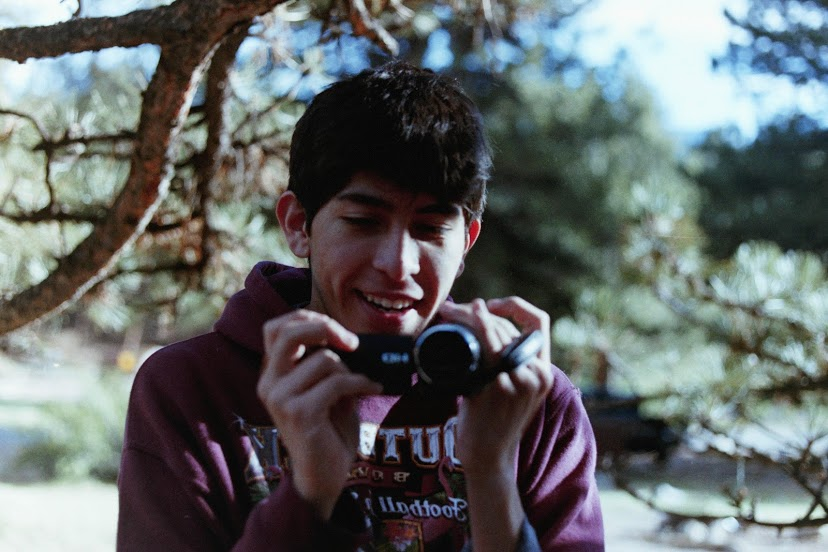

<!DOCTYPE html>
<html>
  
  <head>
    <h1>
      Hello, I'm Isaac Rivera, and this is my website
    </h1>
  </head>
  
  
  <body>
    <h2>
      I'm interested in all sorts of things! You can read about them below...
    </h2>
    <ul>
      <li><a href="Drum_Corps.md">Drum Corps International</a></li>
      <li><a href="Video_Games.md">Video Games</a></li>
      <li><a href="Movies.md">Movies and Videography</a></li>
      <li><a href="Music.md">Music</a></li>
    </ul>
    <h3>
      About me:
    </h3>  
    
 I am an undergraduate engineering student at the University of Missouri. I am working towards my bachelors degree in information technology. I am heavily involved with Marching Mizzou, and am a proud member of the university snare line!

My hometown is <b>St. Joseph Missouri</b>, where I attended Central High School. St. Joseph ('Joetown' for locals) is the biggest small town you'l ever visit! With a population of 75,000, people can usually be seen walking around our recently renovated Felix Square, exploring the beautiful Krug Park, or catching a bite to eat in one of our many locally owned small businesses. The town is extremely historic, with many locals claiming it had the potential to be bigger than Kansas City (if it weren't for that darn railroad being built through KC instead)!
    
You can learn more about St. Joseph here!
    
It's a small town, yes, but it's my home and I love it with all my heart.

    
<h6> This website was constructed for my IT 1000 class at the University of Missouri</h6>
  </body>
</html>
    

    

